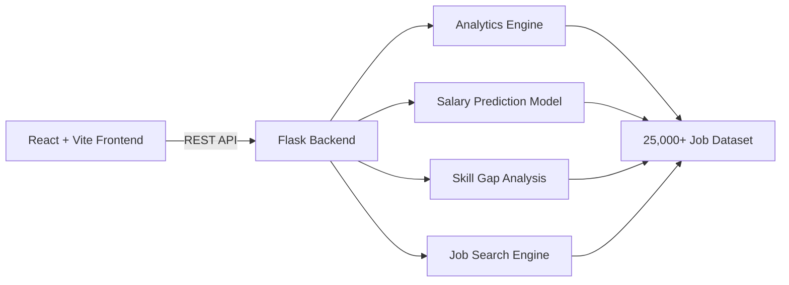
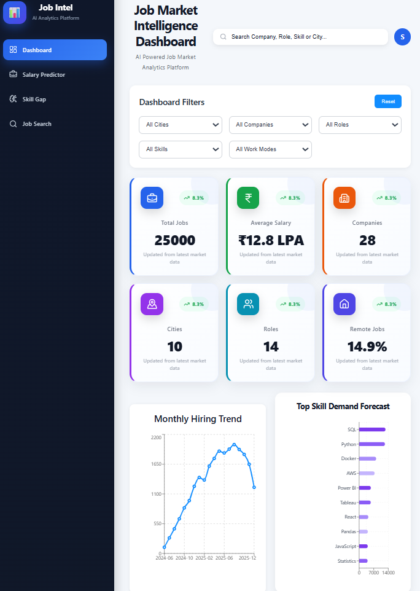
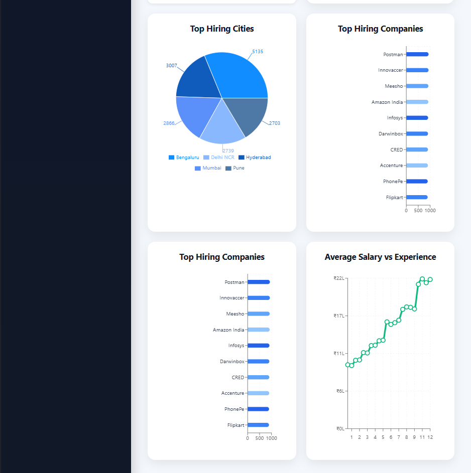
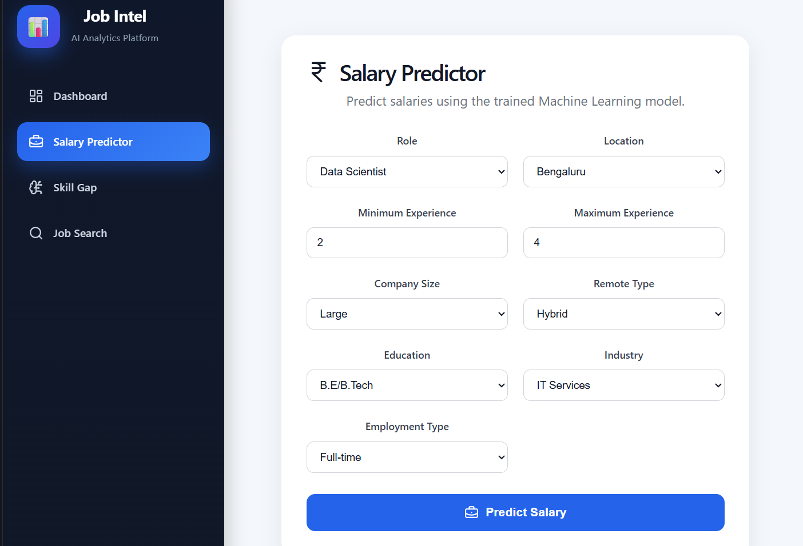
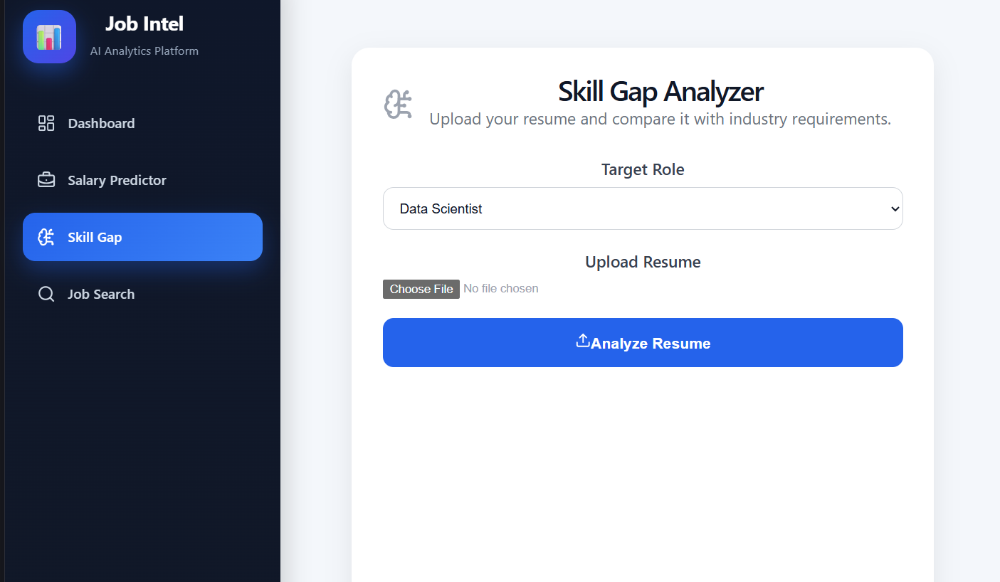
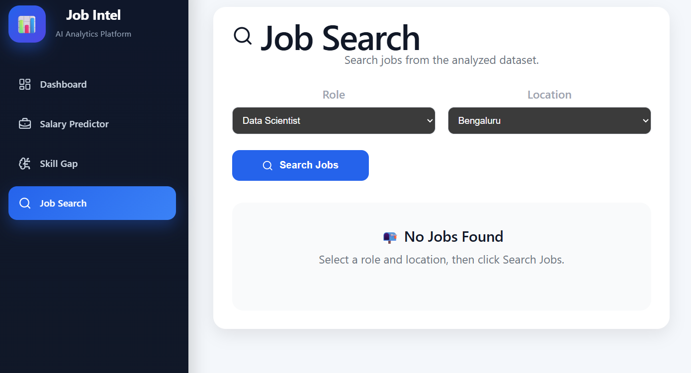

# AI Job Market Intelligence Dashboard

🌐 **Live Demo:** https://job-intel-ten.vercel.app

💻 **GitHub Repository:** https://github.com/srikanthnas/job_intel

An end-to-end data science and full-stack analytics platform that analyzes job market trends, predicts salaries, identifies skill gaps in resumes, and helps users search for relevant jobs through an interactive dashboard.

## Features

- Interactive dashboard with key job market insights
- Salary prediction using Machine Learning
- Resume Skill Gap Analyzer
- Job Search interface
- Trending skills analysis
- Top companies and cities visualization
- Monthly hiring trend analysis
- Skill demand forecasting

## Tech Stack

### Frontend
- React
- Vite
- JavaScript
- CSS
- Axios
- Recharts

### Backend
- Python
- Flask
- Scikit-learn
- Pandas
- NumPy

### Machine Learning
- Random Forest Regressor
- TF-IDF Vectorizer
- Cosine Similarity

## System Architecture


## API Endpoints

| Method | Endpoint | Description |
|--------|----------|-------------|
| GET | `/api/kpis` | Fetch dashboard KPI metrics |
| GET | `/api/trends/monthly` | Monthly hiring trends |
| GET | `/api/skills/forecast` | Skill demand forecasting |
| GET | `/api/cities` | City-wise job analysis |
| GET | `/api/companies` | Company-wise job analysis |
| GET | `/api/roles` | Role-wise analysis |
| GET | `/api/experience` | Experience distribution |
| POST | `/api/salary/predict` | Predict salary based on user inputs |
| POST | `/api/skill-gap/upload` | Analyze resume and identify missing skills |
| GET | `/api/jobs/search` | Search job postings |

## Project Structure

```
job_intel/
├── backend/
├── frontend/
├── data/
├── models/
└── README.md
```

## Screenshots

### Dashboard





### Salary Predictor



### Skill Gap Analyzer



### Job Search



## Installation

### Clone the repository

```bash
git clone https://github.com/srikanthnas/job_intel.git
```

### Backend

```bash
cd backend
pip install -r requirements.txt
python app.py
```

### Frontend

```bash
cd frontend
npm install
npm run dev
```

## Future Improvements

- Deploy the application online
- User authentication
- Real-time job posting integration
- Resume PDF export
- Advanced analytics

## Author

**Srikanth NAS**

GitHub:
https://github.com/srikanthnas
